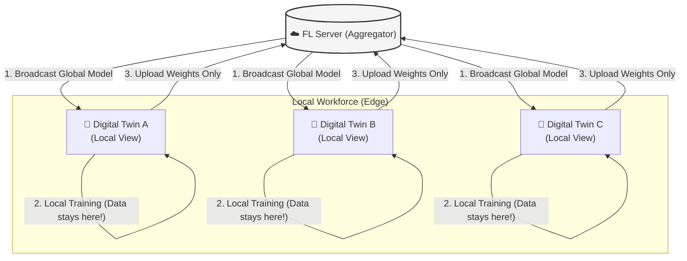
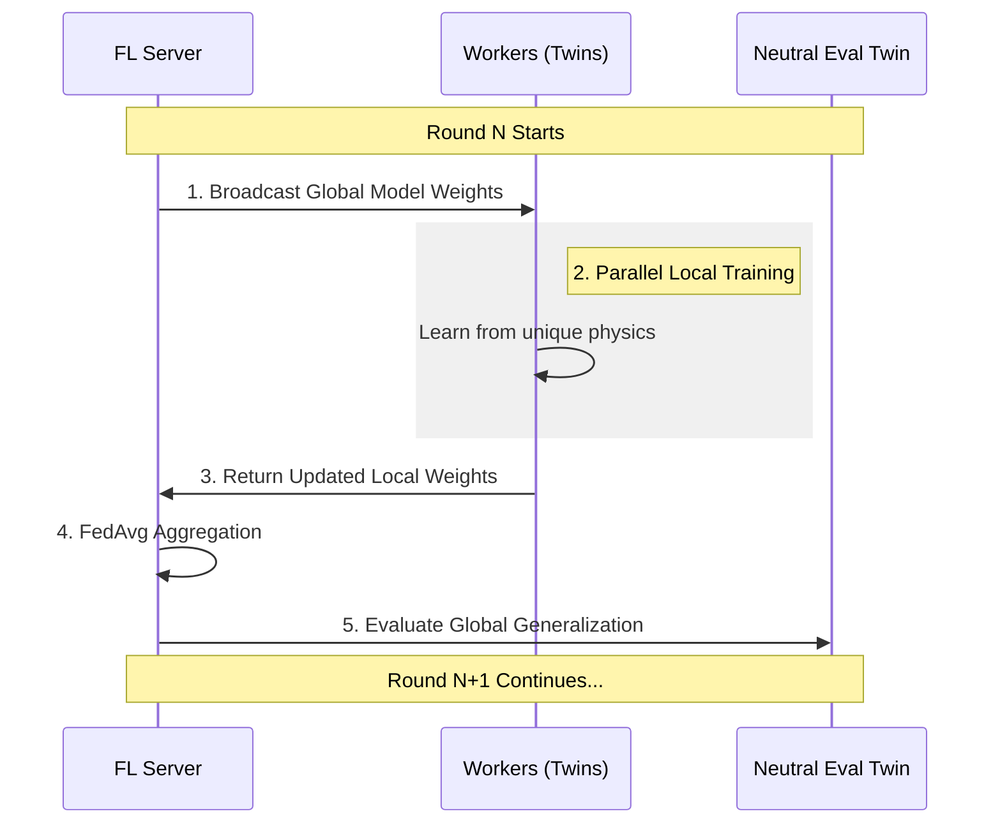
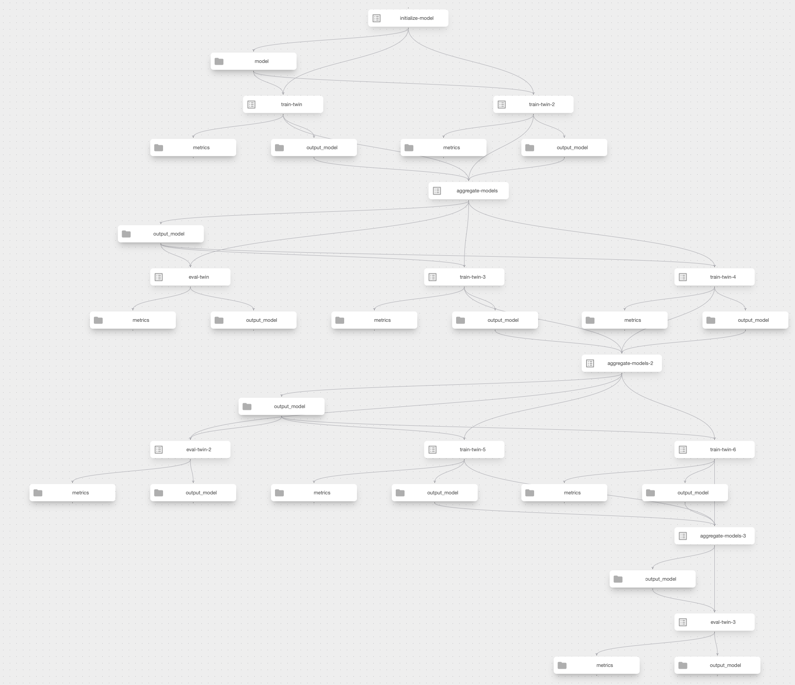
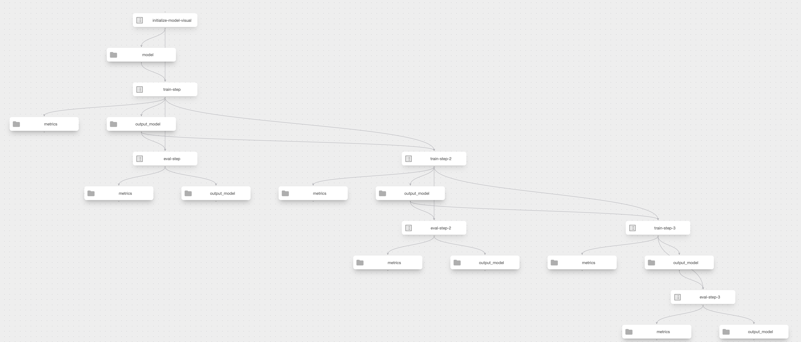
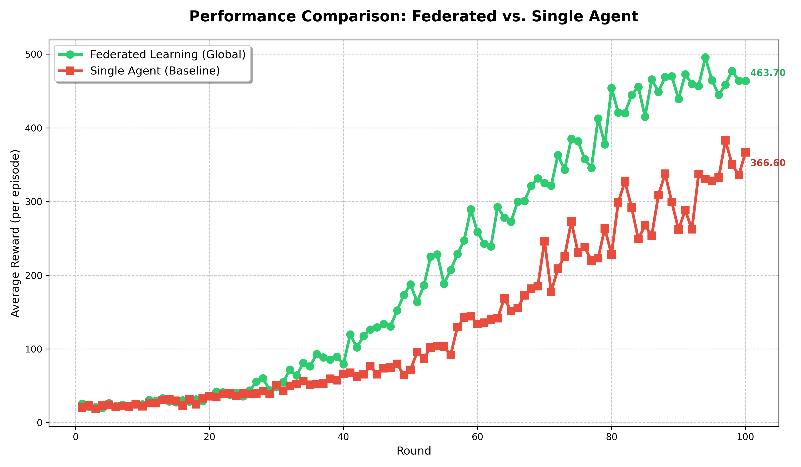

# 🤖 Federated Digital Twin with Kubeflow

[](https://kubeflow.org)

A personal project for learning **Distributed Digital Twin Training** using Federated Learning. This implementation acts as a simulation framework designed for local Kubernetes clusters (e.g., Kind, Minikube) to mock a distributed fleet of systems. While tested extensively on macOS (Colima/Kind), it is compatible with any local Kubernetes environment.

---

## 🏗 Architecture: Digital Twins Meet Federated Learning

### 🤖 What are Digital Twins?

A **Digital Twin** is not just a replica, it's a **living twin** of a physical system that mirrors its behavior, state, and characteristics in real-time. In practice, digital twins continuously sync with their physical counterparts through sensors and data feeds.

```
Physical System ⟷ Digital Twin (Real-time Sync)
     🤖      ⟷        💻
```

**For this project**: We use **simulated environments** (CartPole) as stand-ins for physical systems. While not connected to real hardware, they demonstrate the core FL+DT concepts by creating diverse physics variations.

**The Challenge**: Every physical system is unique (internal tolerances, environmental conditions, and hardware aging).
- System A operates under specific stress conditions.
- System B is a newer model with slightly different response times.
- System C has unique operational wear and tear.

**Traditional Approach**: Train one model on one perfect simulation ❌  
**Our Approach**: Create multiple digital twins, each with different physics ✅

### 🌐 Federated Architecture

Instead of collecting all data centrally, each twin learns **locally** and shares only its "intelligence" (model weights).



### 🌟 Why choose Federated Architecture?

| Benefit | How it works in this project |
| :--- | :--- |
| **🔐 Data Privacy** | Raw training data (states and transitions) never leaves the local Digital Twin. |
| **🚀 Efficiency** | We only transmit model parameters, avoiding the need to transfer full datasets. |
| **🌍 Diversity** | The global model learns from the unique physical variations of every twin simultaneously. |
| **🛡️ Robustness** | If one twin has corrupted data or is offline, the global model still benefits from the rest of the fleet. |
| **✨ Generalization** | The resulting policy is more robust than any model trained on a single environmental variation. |

### 🔄 The FL Training Cycle

Each round of federated learning follows a structured synchronization loop:



### 🎯 The Goal: Generalization Through Knowledge Sharing

**Core Objective**: Build a **single global model** that works well across **all physical variations** by sharing knowledge across the fleet.

**How Knowledge Sharing Works**:
- Twin 1 learns optimal strategies for one set of operational conditions.
- Twin 2 identifies patterns that work in a different environment.
- Twin 3 discovers edge-case adjustments unique to its state.

When these insights are **aggregated**, the global model learns:
- 💡 Robust strategies that work across all observed conditions.
- 💡 Generalized policies that adapt to unseen variations.
- 💡 Collective intelligence gathered from the entire fleet.

**The Result**: A model that performs better on **new, unseen variations** than any individual twin could achieve alone. This is the power of federated learning applied to digital twins—**collective intelligence through privacy-preserving knowledge sharing**!

---

## 📈 Visual vs. Functional Pipelines

This project implements two distinct pipeline strategies to explore different aspects of the ML lifecycle:

### 1. Functional Pipelines (The "Workhorse")
*   **Files**: `fl_k8s_pipeline.py`, `single_k8s_pipeline.py`
*   **Implementation**: Uses a single `PyTorchJob` Custom Resource from the Kubeflow Training Operator.
*   **Why use it**: This is the efficient way to run experiments. Instead of launching individual pods for every round, the entire fleet orchestration is delegated to the Training Operator. It handles distributed synchronization natively, making it much faster.
*   **UI Representation**: Shows as a single, clean "Training" node in the Kubeflow graph.

### 2. Visual Pipelines (The "Narrative")
*   **Files**: `fl_visual_pipeline.py`, `single_visual_pipeline.py`
*   **Implementation**: Creates individual KFP components for every training and evaluation step.
*   **Why use it**: Kubeflow's default representation can be opaque. These pipelines provide **better observability** by mapping each round and worker to a unique component, making it easy to track the flow of weights and parallel training in the Kubeflow UI.

#### **Federated Learning DAG (`fl_visual`)**

*This visualization shows multiple training pods running in parallel for each round, followed by a synchronization step where model weights are aggregated before proceeding to the next iteration.*

#### **Single Agent DAG (`single_visual`)**

*In contrast, the single agent DAG shows a linear progression of training and evaluation rounds, where a single pod learns sequentially without the need for aggregation.*


## 📊 Performance & Analytics

The project includes an automated analysis suite that generates insights after every experiment.

### 1. Federated vs. Single Agent Comparison

**Concept**: Compares the learning efficiency and final performance of the global federated model against a single isolated agent. This metric validates whether collaborative learning across diverse environments yields a more robust policy than learning in single environment.

*   **Analysis Script**: `src/analysis/compare_results.py`
*   **Generated Plot**: `plots/comparison_result.png`



**Key Findings:**
- **Federated Learning (Green)** achieves significantly higher rewards by leveraging knowledge from diverse physics
- **Single Agent (Red)** learns from only one environment, limiting its generalization capability
- FL demonstrates **better generalization** and more stable growth through collective learning
- Both models show initial improvement, but single agents stuck at lower performance due to overfitting, whereas **FL reaches higher performance** due to better generalization.

### 2. Worker Training Dynamics (Worker Diversity)

**Concept**: Measures the variance in training rewards across different twins. In a healthy FL system, we expect individual workers to have different learning curves as they adapt to their unique physical variations, while the global model aggregates these diverse insights.

*   **Analysis Script**: `src/analysis/worker_diversity.py`
*   **Generated Plot**: `plots/worker_diversity.png`

### 3. Generalization Gap

**Concept**: Measures the difference between a model's performance on its training environment vs. a neutral evaluation environment. A smaller gap indicates that the model has truly learned robust policies rather than just memorizing a specific condition. Federated learning typically minimizes this gap by forcing the model to solve for multiple physics variations simultaneously.

*   **Analysis Script**: `src/analysis/generalization_gap.py`
*   **Generated Plot**: `plots/generalization_gap_{type}.png`

---

## 🧪 MLflow Tracking

The project uses **MLflow** for centralized experiment tracking and metric visualization.

### 🏛 Unified Tracking Strategy
We implement a "Single Execution, Single Run" strategy to keep the experiment history clean:
- **Experiment by Type**: Runs are grouped into experiments based on the pipeline type (e.g., `Fed-Twin-FL`, `Fed-Twin-Single-Visual`).
- **Unified Runs**: Each pipeline execution creates exactly **one** MLflow run. All parallel workers and sequential rounds log to this unique run.
- **Prefix-Based Metrics**: Metrics are prefixed with worker IDs (e.g., `train-twin-1/reward`, `eval-twin-global/loss`) to distinguish between different sources within the same timeline.

### 🖥 Monitoring & Debugging

Both MLflow and Kubeflow Pipelines (KFP) provide specialized UIs for monitoring.

- **MLflow UI**: Track RL metrics, compare runs, and manage model artifacts.
  - **URL**: [http://localhost:5050](http://localhost:5050)
- **KFP UI**: Visualize pipeline execution graphs, logs, and artifacts.
  - **URL**: [http://localhost:8080](http://localhost:8080)

> [!NOTE]
> Artifacts (model weights and metrics) are stored in the integrated MinIO bucket via S3-compatible API.

---

## 🚀 Getting Started
### 1. Prerequisites
- **Kubernetes Cluster**: A local cluster like [Kind](https://kind.sigs.k8s.io/) or [Minikube](https://minikube.sigs.k8s.io/).
- **Container Runtime**: Docker Desktop, Colima, or Podman.
- **Tools**: `kubectl`, `python 3.10+`, and `uv`.

### 2. Local Setup (Recommended)
You can setup the local `kind` cluster and deploy the infrastructure using `make`:

```bash
# Setup the local Kind cluster and Kubeflow dependencies
make k8s-setup
```

### 3. Pipeline Execution
Run the pipelines using `make run-pipeline`:
```bash
make run-pipeline ARGS="all"            # Run all pipelines sequentially
make run-pipeline ARGS="single"         # Run single worker baseline
make run-pipeline ARGS="fl"             # Run full federated fleet
make run-pipeline ARGS="fl_visual"      # Run FL with real-time DAG visualization
make run-pipeline ARGS="single_visual"  # Run single agent with DAG visualization
```

### 4. Teardown
To destroy the local cluster, you can run:
```bash
make k8s-teardown
```

---

## 📂 Repository Structure

*   **/src/core**: The core code of the project, including `engine.py` (physics simulation), `client.py` (RL training), and `server.py` (FL aggregation).
*   **/src/pipelines**: Definitions for Kubeflow Pipelines (KFP).
*   **/src/analysis**: Python scripts for generating professional plots and metrics analysis.
*   **/metrics**: Consolidated CSV results from every cluster run.
*   **/plots**: Generated visualizations showing project performance.

---

## 📄 License
This project is licensed under the MIT License - see the [LICENSE](LICENSE) file for details.

---

